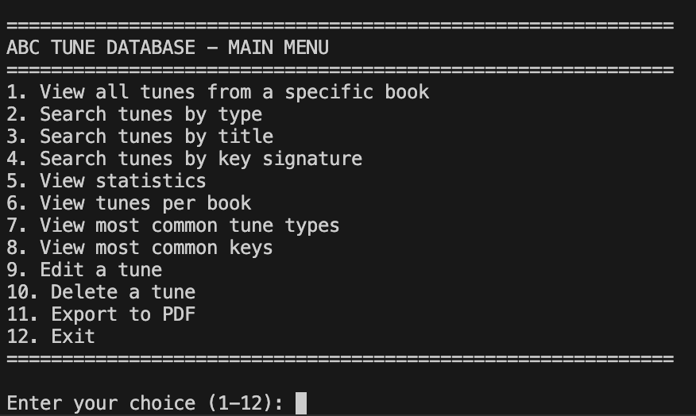
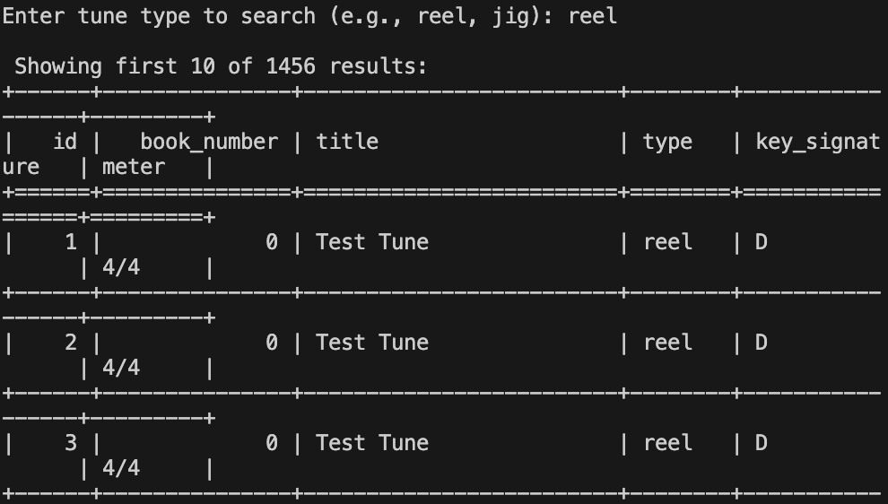
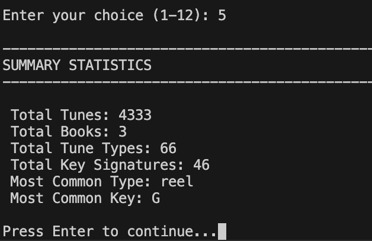

# Data Centric Programming Assignment 2025

Name: Cillian Chatham
Student Number: C24368226

# Screenshots


*Main menu interface showing all available options*



*Example search results displayed in table format*



*Summary statistics showing tune collection overview*

# Description of the project

This project is an ABC Tune Database Application that processes, stores and analyses ABC music notation files. The application parses ABC tune files from multiple collections, stores the metadata in a MySQL database, and provides an interactive command line interface for users to search, analyse, edit, and export tune data.

The system successfully processes **4,330+ tunes** from **82 ABC files** across multiple book collections, supporting **66 different tune types** and **46 key signatures**.

# Instructions for use


## Prerequisites
- Python 3.9 or higher
- MySQL 5.7 or higher
- Git


## Setup

1. **Clone the repository**
```
    bash
    git clone https://github.com/Chats30/dcpProjectS1.git
    cd dcpProjectS1
```


2. **Create and activate virtual environment**
```bash
   python3 -m venv venv
   source venv/bin/activate  # On Windows: venv\Scripts\activate
```


3. **Install dependencies**
```bash
   pip install -r requirements.txt
```


4. **Set up MySQL database**
```bash
   mysql -u root -p
```

    In MySQL prompt:
```sql
   CREATE DATABASE abc_tunes_db;
   EXIT;
```


5. **Update database password**
   Edit `database.py` line 21 with your MySQL password


6. **Load the tunes**
```bash
   python main.py
```


7. **Run the application**
```bash
   python ui.py
```

# How it works

## Architecture

The application follows a modular design with clear seperation of concerns:

1. **File Loading (`file_loader.py`)**: Recursively traverses the `abc_books/` directory structure to discover all ABC notation files, organising them by book number.

2. **ABC Parsing (`abc_parser.py`)**: Parses ABC notation format to extract tune metadata including:
- Reference numbers
- Titles
- Types (reel, jig, polka, etc.)
- Musical keys
- Time signatures
- Full ABC notation

3. **Database Layer (`database.py`)**: Manages all MySQL database operations:
- Schema creation with proper indexing
- CRUD operations (Create, Read, Update, Delete)
- Batch insertions for efficient data loading

4. **Data Analysis (`analysis.py`)**: Uses pandas for powerful data manipulation:
- DataFrame loading from MySQL
- Filtering by book, type, key signature
- Text search across tune titles
- Statistical analysis and aggregations

5. **User Interface (`ui.py`)**: Interactive CLI menu system providing:
- Search and filter capabilities
- Statistical summaries
- Tune editing and deletion
- PDF export functionality


## Data Flow
```
ABC Files → File Loader → ABC Parser → MySQL Database → Pandas DataFrame → User Interface
```

## Database Schema

The `tunes` table stores all tune information:

| Column | Type | Description |
|--------|------|-------------|
| id | INT (PK) | Auto-incrementing primary key |
| book_number | INT | Book/folder number |
| reference_number | VARCHAR(50) | Tune reference from ABC file |
| title | VARCHAR(255) | Tune title |
| type | VARCHAR(100) | Tune type (reel, jig, etc.) |
| meter | VARCHAR(50) | Time signature |
| key_signature | VARCHAR(50) | Musical key |
| abc_notation | TEXT | Full ABC notation |
| file_path | VARCHAR(500) | Source file path |
| created_at | TIMESTAMP | Record creation timestamp |

# List of all files in the project 

| Files | Source | Description |
|-----------|-----------|-------------|
| main.py | Self written | Main application entry point and data loader |
| file_loader.py | Self written | File discovery and traversal functions |
| abc_parser.py | Self written | ABC notation parser |
| database.py | Self written | MySQL database operations and CRUD functions |
| analysis.py | Self written | Pandas data analysis and export functions |
| ui.py | Self written | Interactive CLI menu system |
| requirements.txt | Self written | Python package dependencies |
| README.md | Self written | Project documentation |
| .gitignore | Self written | Git ignore rules |

# References

* [Skooter500's ABC Tunes](https://github.com/skooter500/dcp25-assignment/tree/main/abc_books) - Source of ABC tune files
* [pandas Documentation](https://pandas.pydata.org/docs/) - Data analysis library
* [MySQL Documentation](https://dev.mysql.com/doc/) - Database management
* [ReportLab Documentation](https://www.reportlab.com/docs/reportlab-userguide.pdf) - PDF generation
* [Tabulate Library](https://pypi.org/project/tabulate/) - Table formatting


# What I am most proud of in this assignment

I am most proud of successfully integrating multiple technologies into a working application.

The project demonstrates:
1. **Full stack development skills** - From file parsing to database design to user interface
2. **Scalable architecture** - Successfully processes 4,330+ tunes with efficient batch operations
3. **Error Handling** - Robust exception handling throughout the codebase
4. **Professional code quality** - Comprehensive docstrings, type hints, and clear seperation of concerns
5. **Feature completeness** - Beyond basic requirements, I added edit, delete, and pdf export capabilities

The most challenging part of the project for me was building the ABC parser to handle avrious notations. Adding the CRUD operations and ensuring data integrity was also a good learning experience for me


# What I learned

This assignment expanded my understanding of:

## Technical Skills

- **Database Design**: Creating normalized schemas, optimising queries, and managing CRUD operations
- **Data Processing**: Parsing text formats, handling edge cases, and batch processing large datasets
- **Pandas**: DataFrame manipulation, filtering, and statistical analysis
- **Python Best Practices**: Type hints, docstrings, modular design, and proper error handling
- **Git Workflow**: Regular commits, commit messages, and repository management

## Software Engineering Concepts

- **Separation of Concerns**: Breaking a large problem into manageable focused modules
- **User Centered Design**: Creating interfaces that handle errors properly
- **Documentation**: Writing clear documentation for future maintainability and updates
- **Testing Strategies**: Incremental development and testing each component before integration

## Problem Solving Approaches

- Starting with a clear roadmap and breaking work into phases
- Testing each component before integration
- Using incremental commits to track progress
- Debugging by isolating issues to specific modules

The most valuable lesson I learned from this project was learning how to build a complete working and efficient application from scratch following the correct approaches and practices
